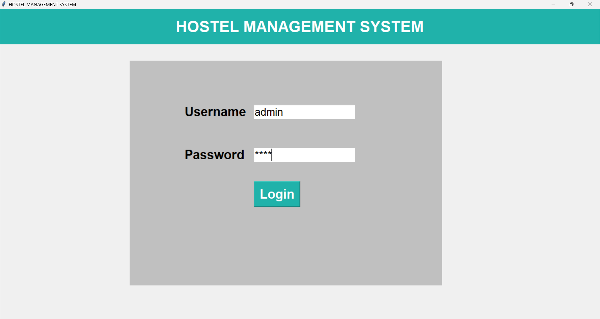
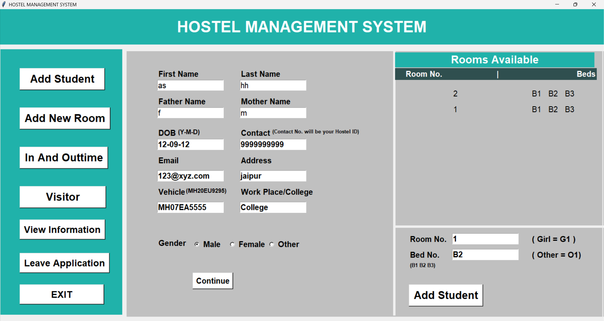

# Hostel Management System 🏨

A comprehensive and user-friendly desktop application built using file handling and GUI Python and Tkinter 

## ✨ Key Features

- **🎓 Student Management:** Add new students with complete details and allocate rooms/beds dynamically.
- **🚪 Room Allocation:** Create new rooms categorized by gender (Boys/Girls/Others) and track bed availability in real-time.
- **⏱️ In & Out Time Tracking:** Keep a secure log of students leaving and entering the hostel premises with remarks.
- **👥 Visitor Logs:** Register visitors and link their details directly to the respective student and room number.
- **📝 Leave Application:** Manage and record student leave requests along with their expected return dates.
- **📊 View Information:** View all student details and room-wise allocation in a clean tabular format.
- **📥 Export to Excel:** Download all student records into a `.csv` file with a single click for easy reporting.
- **🗑️ Delete & Free Up Beds:** Remove a student's record and automatically free up their allocated bed in the system.

## 🛠️ Technologies Used

- **Programming Language:** Python 3.x
- **GUI Framework:** Tkinter
- **Database/Storage:** Text File Handling
- **Export Module:** CSV Module

## 🚀 How to Run the Project

1. Clone this repository to your local machine:
   ```bash
   git clone [https://github.com/yourusername/Hostel-Management-System.git](https://github.com/yourusername/Hostel-Management-System.git)

2.
## Images
### 1. Login Screen


### 2. Main Dashboard & Add Student


### 3. Add Rooms


### 4. In Out Timming


### 5. Visitors


### 6. View Information for Student


### 7. View Information for Room


### 8. Leave Application

